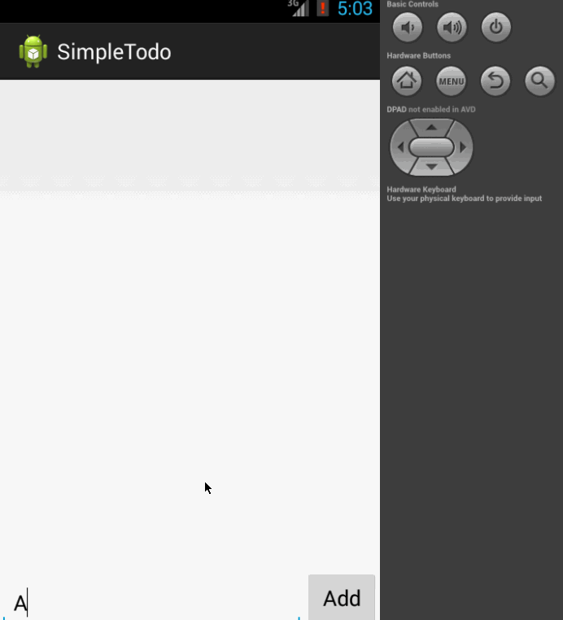

#Simple Todo

This is a simple todo app. Text items can be added/removed from the app. These items persist between runnings of the app, by being written to a file on the system. `

Time: <2 hours
Features completed:

   * [x] Add items
   * [x] Remove items
   * [x] Save/Load items by writing/reading from a file.

Walkthrough:

GIF created with [LiceCap](http://www.cockos.com/licecap/).
